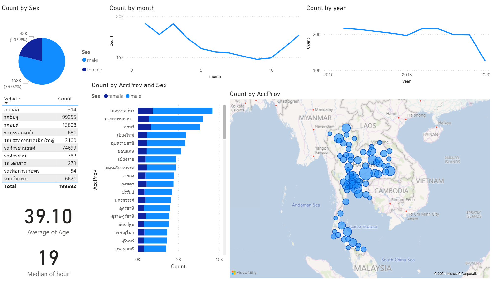

# Dashboard ข้อมูลผู้เสียชีวิตจากอุบัติเหตุทางถนนปี พ.ศ. 2554 - 2563 ด้วย Power BI

    

## สรุปผล
* เพศชายเกิดอุบัติเหตุมากกว่าเพศหญิง โดยเพศชายเกิดอุบัติเหตุ 158,000 ราย และเพศหญิง 42,000 ราย
* โดยรถที่เกิดอุบัติเหตุส่วนมากจะเกิดจากรถอื่นๆ รถจักรยานยนต์ และรถยนต์เป็นหลักคือ 99,255 74,699 13,808 รายตามลำดับ
* โดยจะพบว่าในช่วงเดือนการเกิดอุบัติเหตุที่พบมากที่สุดคือเดือนมกราคม เนื่องจากเป็นวันเทศกาลปีใหม่ คนอาจจะกลับภูมิลำเนามากขึ้น ในการที่จะเฉลิมฉลองวันปีใหม่
* ในการเกิดอุบัติเหตุในแต่ละปีจะพบว่า มีการเกิดอุบัติเหตุมากที่สุดอยู่ที่ปี 2010 และหลังจากปี 2016 เป็นต้นมามีอัตราการเกิดอุบัติเหตุลดลงทุกๆปี โดยตั้งแต่ปี 2018 เป็นต้นมาจะพบว่ามีอัตราการเกิดอุบัติเหตุลดลงอย่างเห็นได้ชัด ซึ่งอาจจะเกิดจากสถานการณ์โควิดทำให้ไม่สามารถที่จะออกไปไหนได้สะดวกทำให้มีการเกิดอุบัติเหตุที่น้อยลง
* โดยจังหวัดที่เกิดอุบัติเหตุมากที่สุดจะพบว่า  จังหวัดนครราชสีมา กรุงเทพมหานคร และชลบุรีเชียงใหม่ ตามลำดับ
* อายุ 39 ปีจะพบว่าเกิดอุบัติเหตุโดยเฉลี่ย
* เวลา 1 ทุ่มคือเวลาที่จะเกิดอุบัติเหตุโดยเฉลี่ย

<<<<<<< HEAD
    
=======
    
>>>>>>> 1cb6513acc67b9adcb92f9d8eebaadd192a6ab36
